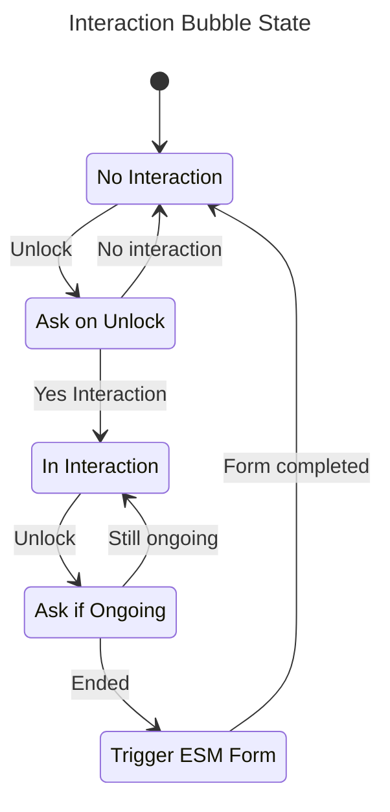
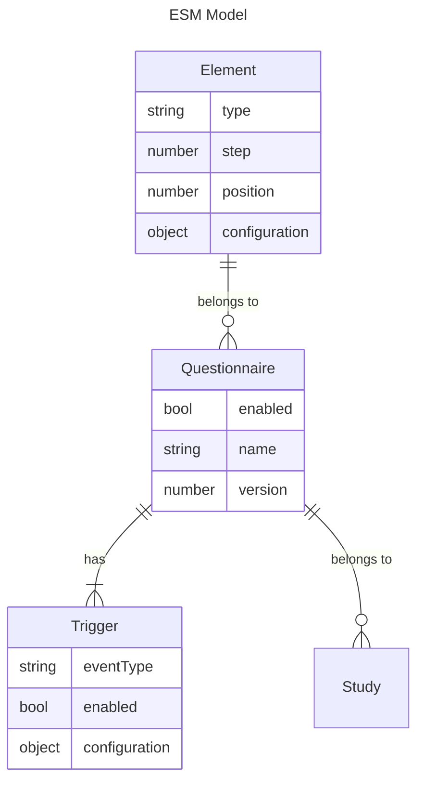

# WHALE
Social Sensing environment with Experience Sampling capabilities.

## Tasks
- [ ] Import Experience Sampling elements from Excel tables
- [ ] Allow to sample on lock/unlock and continuously in a set interval (maybe we can define some sensors to run in a periodic interval and others to sample on interaction)
- [ ] Implement API in app (pushing data, showing study name)
- [ ] Add notification sensor
- [x] Add interaction tracking bubble
- [x] Add onboarding interface (permissions, enrolment) and basic main activity for the app
- [x] Use WorkManager to schedule backend pushes
- [x] Add radio frequency (Bluetooth and WiFi) sensor
- [x] Detect if a conversation happens (see openSMILE)
- [x] Revamp AppSensor so it actually retrieves the currently open app (probably with AccessibilityService)
- [x] Sample whenever the device gets unlocked
- [x] Create simple backend that receives pushed data (audio and other sample readings)
- [x] Add (crude) study enrolment interface
- [x] Integrate AudioSampleService to use default content pipeline

## Components
* [Android App](app-android): The app that records sensor data. Needs to be installed on participant's devices
* [Backend](backend): The backend that allows for data storage. Deployed on a server.

> [!NOTE]  
> See the component's respective READMEs for more information.

### Interaction Bubble
We want to track if an interaction is happening and relying on sensors alone would not be sufficient. We use the following approach:
- a sticky and unobtrusive widget flows around the screen
- when no interaction was marked, we ask the user on unlock, if they are in an interaction
- on each unlock, we ask if this interaction is still ongoing
- if they mark the interaction as ended, an experience sampling form is triggered

### Experience Sampling
We want to trigger an experience sampling form when specific events happen:
- important: **user marks an interaction ended**
- possibly in a specific interval

A sampling could include the following:
- content separated in steps (title, position)
  - visual/content
    - (rich) text
  - input
    - text
    - radio
    - checkbox
    - Likert scale
    - slider
    - affect grid
    - time/duration

After updating any element of the questionnaire, its version needs to be updated. The app will only update the questionnaire if the version is higher than the one currently cached.

## Acknowledgements & References
Based on the [SenseEverything](https://github.com/mimuc/SenseEverything) app.

* Weber, D., & Mayer, S. (2014). LogEverything. GitHub Repository. Retrieved from https://github.com/hcilab-org/LogEverything/