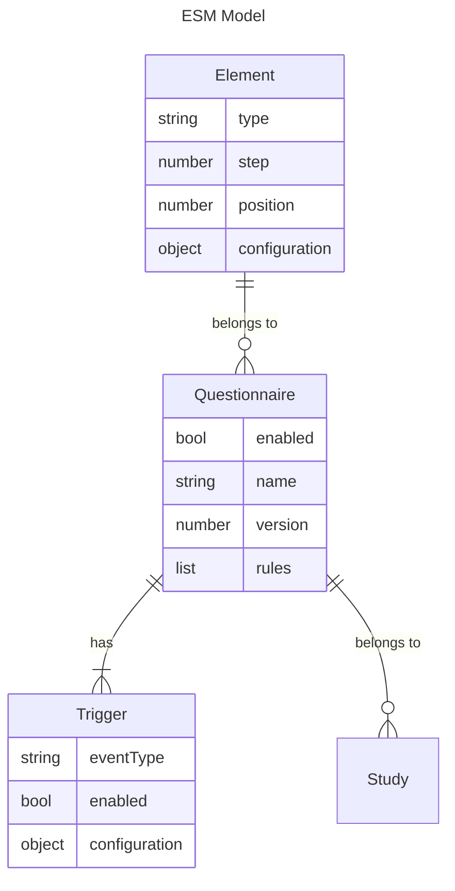

# WHALE
Social Sensing environment with Experience Sampling capabilities.

> [!IMPORTANT]  
> Wenn Sie auf der Suche nach Informationen zur Teilnahme an der aktuell laufenden WHALE-Studie sind, besuchen Sie bitte [diese Webseite](https://www.charlotte-fresenius-uni.de/whale-studie/).
> 
> If you're looking for how to participate in the WHALE study, please [follow this link (in German)](https://www.charlotte-fresenius-uni.de/whale-studie/) for information on how to enrol in the study.

## Components
* [Android App](app-android): The app that records sensor data. Needs to be installed on participant's devices
* [Backend](backend): The backend that allows for data storage. Deployed on a server.

> [!NOTE]  
> See the component's respective READMEs for more information.

### Interaction Bubble & NotificationTriggers
We want to track if an interaction is happening and relying on sensors alone would not be sufficient. We use the following approach:
- a sticky and unobtrusive widget flows around the screen based on conditions defined as a [NotificationTrigger](app-android/README.md)
  - the widget shows questions from a questionnaire (see [Experience Sampling](#experience-sampling))
- rules defined in the displayed questionnaire determine if a new NotificationTrigger is added, or another full questionnaire is shown
- this setup allows for conditional EMAs based on what the participant answered in a previous EMA

### Experience Sampling
We want to trigger an experience sampling form when specific events happen:
- rule from interaction bubble evaluates to show a new full questionnaire (triggered by `event` trigger)
- in a specific interval
  - every day at the same time (triggered by `periodic` trigger)
  - EMA: across the day, with a minimum time between samples (triggered by `random_ema` trigger)
- once, for example for the takeout questionnaire at the end of a study (triggered by `one_time` trigger)
- for displaying the questionnaire inside the floating widget (triggered by `ema_floating_widget_notification` trigger)

A sampling could include the following:
- content separated in steps (title, position)
  - visual/content
    - (rich) text
  - input
    - text
    - radio
    - checkbox
    - Likert scale
    - slider
    - affect grid
    - time/duration
    - circumplex (affect grid)
    - social network
      - entry: possibility to list people in sampling
      - rating: possibility to answer questions about a person
    - button list (only available for floating widget)
  - link to external questionnaire (is embedded in questionnaire to instruct the participant)

After updating any element of the questionnaire, its version needs to be updated. The app will only update the questionnaire if the version is higher than the one currently cached.

### When it samples
- after unlocking: for one minute
- in the background: ever five minutes for one minute

### Study Configuration
The platform's backend allows multiple studies to be configured and run in parallel, while each participant can only take part in one study at a time.
Configuration can be done via the [backend's API](backend/api.yaml) or directly on the database.

A study's configuration consists of:
- Name
- Enrolment key (which participants need to enter to join the study, unique across all studies)
- Maximum number of participants `maxEnrolments`, -1 for unlimited participants
- Duration in days `durationDays`
- Experimental Group allocation strategy `allocationStrategy`, only `sequential` is supported for now
- **Experimental Groups**
  - Name
  - Order
  - **Phases**
    - Starting day
    - Duration in days
    - Configuration parameters
      - Interaction widget display mode (in time buckets, every time, disabled)

## License
All changes starting with commit `cf73063b` are licensed under the [AGPL-3.0 (links gnu.org)](https://www.gnu.org/licenses/agpl-3.0.html) license.
The original work remains under the MIT license. See the [LICENSE](LICENSE.md) file for details. Please adhere to the license to ensure **transparent and open research**.

## Acknowledgements & References
Based on the [SenseEverything](https://github.com/mimuc/SenseEverything) app.

* Weber, D., & Mayer, S. (2014). LogEverything. GitHub Repository. Retrieved from https://github.com/hcilab-org/LogEverything/